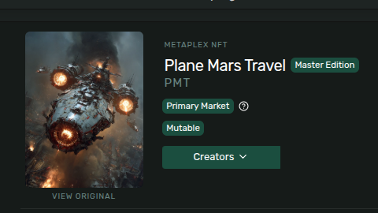

# Q3 2025 – Turbin3 Builders

Hey there! 👋  
If you're reading this, welcome!  
This repository is specially created for learning and practicing advanced concepts I explored during the **Turbin3 Q3 2025 Cohort**.

---

### 🔐 On-Chain Wallet Key

```env
OnChain_Wallet_Key = "ExUttmYkaNKjTPgg6yRkZdrdCH2VC1N5MDp7L424fCss"
````

---

### 📘 My Learnings

1. Initialize TypeScript project:

   ```bash
   npx tsc --init
   ```

2. Set the following in `tsconfig.json`:

   * `"resolveJsonModule": true` → Allows importing `.json` files
   * `"allowSyntheticDefaultImports": true` → Enables importing modules without default exports
   * `"module": "esnext"` → Fixes issues when importing JSON with `import wallet from './onchain-wallet-key.json' assert { type: "json" };`

3. **Node.js Version:**
   `v24.3.0` is used for this project.

---

### 🖼️ Creating an NFT Collection

* Run `nft-image.ts` → Uploads the NFT image
* Run `nft-metadata.ts` → Creates the NFT metadata
* Run `nft-mint.ts` → Mints the NFT



---

### 💰 Creating SPL Tokens (like USDC, USDT, etc.)

* Run `spl-init.ts` → Creates a Mint Account
* Run `spl-mintdata.ts` → Adds token metadata
* Run `spl-mint.ts` → Mints tokens


