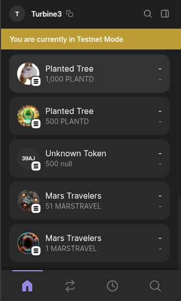

# q3_25_turbin3_builders
Hey there!,
If you are on this repo. I want to clarify this repo is specially made for learning and practicing the concepts in depth that I have learned in the turbin3 cohort.

----
`OnChain_Wallet_Key= ` **"ExUttmYkaNKjTPgg6yRkZdrdCH2VC1N5MDp7L424fCss"**`

### My Learnings:
1. `npx tsc --int` to create tsconfig file
2. `resolveJsonModule` is set to true in tsconfig file to allow importing json files
3. `allowSyntheticDefaultImports` is set to true in tsconfig file to allow importing modules without default export
4. `"module": "esnext"` is set to true in tsconfig file. It fix importing `JSON` files importing error `import wallet from './onchain-wallet-key.json' with { type: "json" };`
5. `v24.3.0` - Node version for this repo
6. ***For Creating TOken Like USDC, USDT, etc.***
   -  Run `spl-init.ts` to create Mint Account
   -  Run `spl-mintdata.ts` to mint token with metadata
   -  Run `spl-mint.ts` to mint token
   -  
  
7.  ***For Creating NFT Collection***
    -  Run `nft-image.ts` to create and upload NFT Image
    -  Run `nft-metadata.ts` to create NFT Metadata
    -  Run `nft-mint.ts` to create NFT Mint
    -  